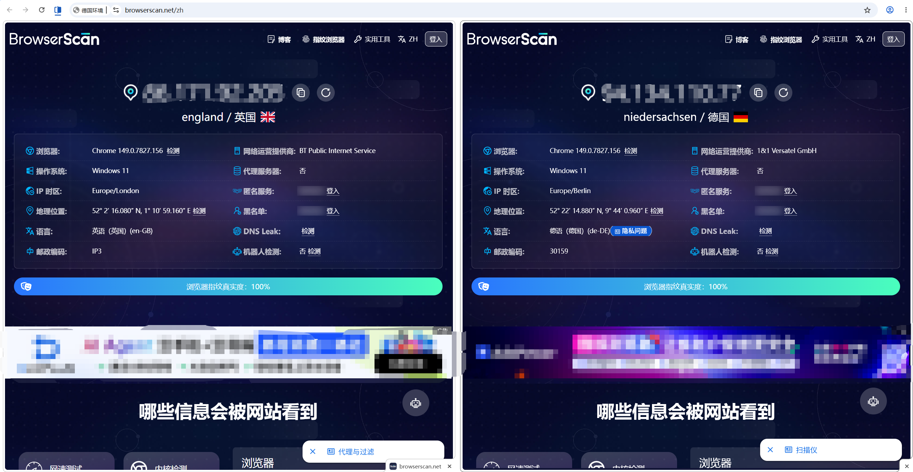
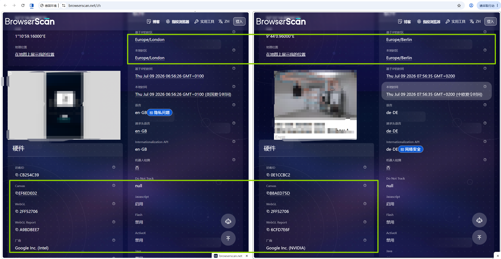
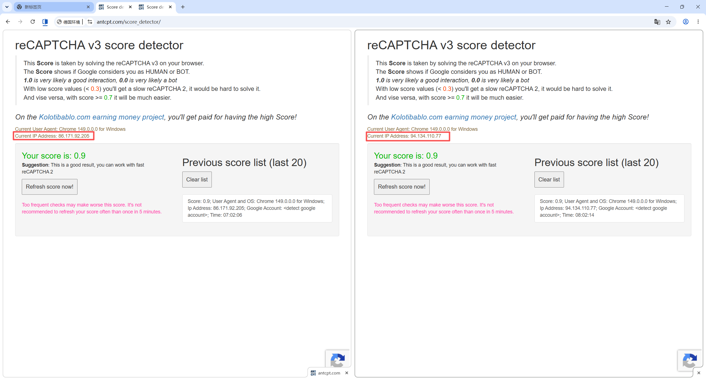
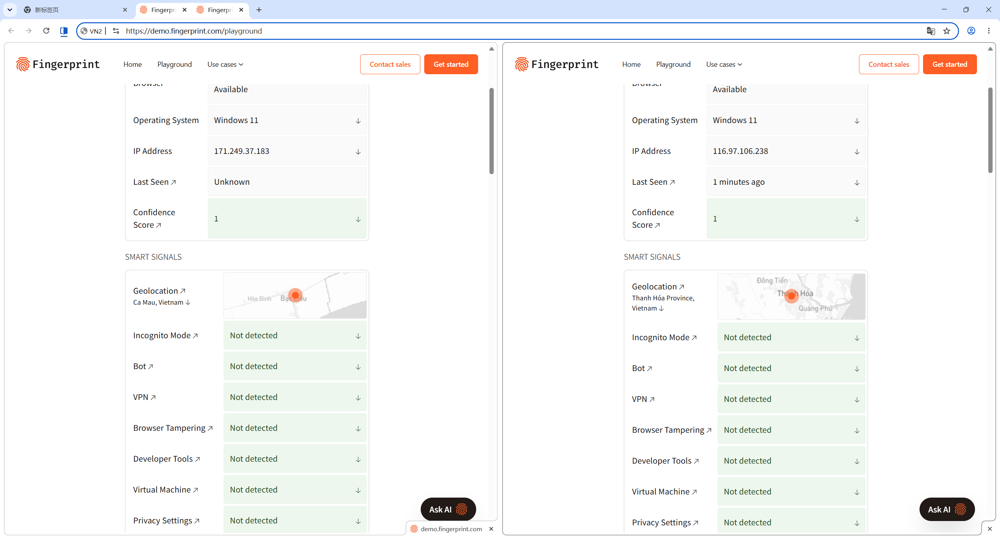

# EasyBrowser

[简体中文](readme.md) | [English](README_EN.md)

EasyBrowser is built with C++ source-level fingerprint protection for automation, multi-account operations, and environment isolation testing. It runs multiple isolated Tab containers inside a single browser instance, giving each tab its own fingerprint, proxy, and data space.

Supported platforms:    

## Key Features

| Feature | Description |
| --- | --- |
| Tab-Level Isolation | Each Tab maps to an isolated container. Fingerprints, Cookies, and proxies do not interfere with each other. |
| Official Alignment | Aligns with mainstream Google Chrome version characteristics and closed-source components. |
| Deep Fingerprint Protection | Covers Canvas, WebGL, AudioContext, WebRTC, Worker, virtual machine, and other detection surfaces. |
| Proxy Support | Supports HTTP, SOCKS5, and username/password proxy authentication. |
| Traffic Control | Supports JS and CSS proxy routing, saving 80%+ traffic. |
| Loading Optimization | Supports disabling high-traffic resources such as images and fonts to improve loading speed and reduce memory usage. |
| AI MCP | Supports AI automation workflows through [EasyBrowserMCP](https://github.com/EasyBrowserMaster/EasyBrowserMCP) for environment management, task orchestration, and browser control. |
| Resource Usage Optimization | Multiple containers share a single browser instance, reducing memory usage during concurrent tasks. |
| Mobile Support | iPhone / Android mobile features are in development. |

## Isolation

EasyBrowser does not simply duplicate multiple browser windows. Its core design is to run multiple isolated containers inside one browser instance.

- Data isolation: Cookie, LocalStorage, IndexedDB, and other site data are isolated per Tab.
- Fingerprint isolation: language, timezone, resolution, WebGL, Canvas, Audio, WebRTC, speech list, and Worker fingerprints are generated independently.
- Proxy isolation: each Tab can use an independent outbound proxy, and dynamic switching does not affect other environments.

| Scenario | Platform | Result |
| --- | --- | --- |
| Fingerprint Test | browserscan | ✅ Passed |
| Fingerprint Test | creepjs | ✅ Passed |
| Fingerprint Test | fingerprintjspro | ✅ Passed |
| Risk-Control Test | reCAPTCHA v3 | ✅ 0.9 |
| Risk-Control Test | Cloudflare Verification | ✅ Passed |
| Risk-Control Test | hCaptcha Verification | ✅ Passed |
| Platform Test | Microsoft Email Registration | ✅ Success |
| Platform Test | TikTok Registration | ✅ Success |
| Platform Test | GitHub Registration | ✅ Success |

### Test Script Examples

[EasyBrowserExamples](https://github.com/EasyBrowserMaster/EasyBrowserExamples): test scripts for Cloudflare Turnstile and reCAPTCHA v3.

### Test Screenshots

  

  

  

  

## Usage Statement And Disclaimer

EasyBrowser is intended only for lawful and compliant technical research, automation testing, account environment isolation, privacy protection, and development debugging.

By downloading, installing, running, or distributing this project, users are responsible for ensuring that their purpose, method, and environment comply with applicable laws and regulations, regulatory requirements, and the terms of service of target websites or platforms.

### Compliant Use

This project may be used for lawful scenarios including:

- Personal privacy protection and browser environment isolation
- Authorized and compliant account and store environment management
- Browser automation learning and research
- Fingerprint consistency, environment isolation, and compatibility testing
- Authorized security research, risk-control testing, and development debugging
- Lawful, compliant, non-profit personal research and technical exchange

### Prohibited Use

EasyBrowser must not be used for any prohibited activity, including but not limited to:

- Activities that violate applicable laws, regulations, public order, or platform rules
- Attacks, harassment, bulk abuse, malicious registration, credential stuffing, traffic manipulation, or spam
- Unauthorized access, control, collection, processing, or distribution of third-party data
- Bypassing platform security mechanisms to conduct illegal, non-compliant, or rights-infringing activities
- Collecting data that is explicitly prohibited by laws, platform terms, or Robots protocols
- Any activity that may harm individuals, platforms, systems, or public network security

### Liability

Users are solely responsible for all actions, data, risks, disputes, and legal consequences arising from their use of EasyBrowser.

The copyright holder is not liable for any direct or indirect loss caused by use, misuse, or inability to use EasyBrowser, including but not limited to account restrictions, data loss, business interruption, third-party claims, or legal liability.

If a user violates this statement or applicable laws and regulations, the copyright holder reserves the right to terminate authorization and pursue legal remedies.
